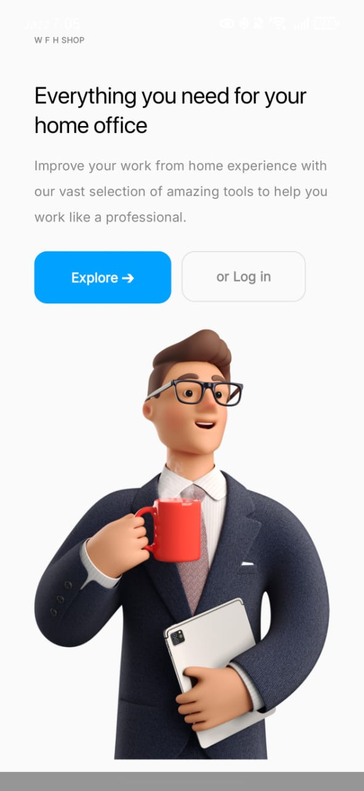
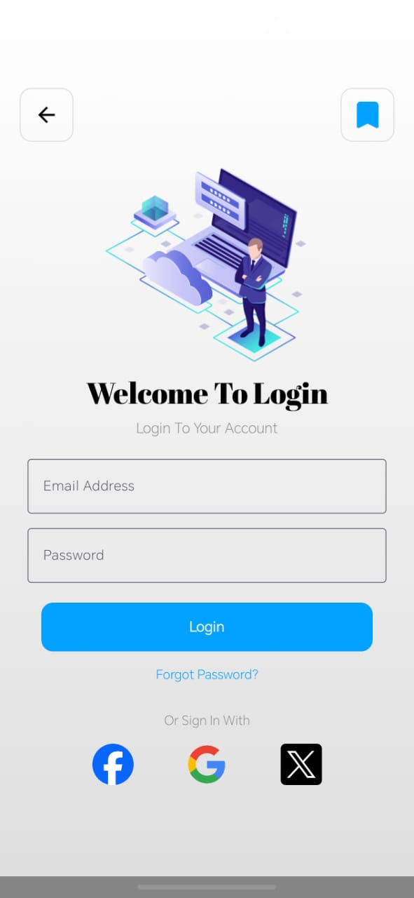
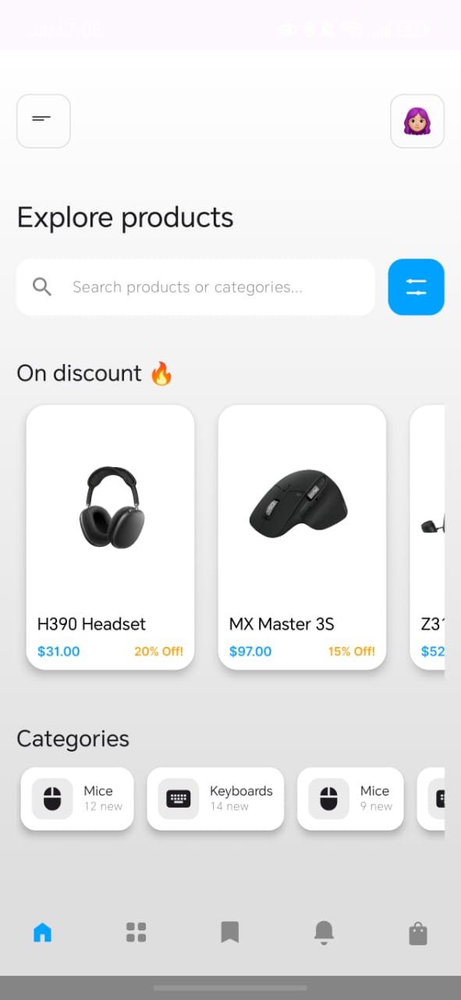
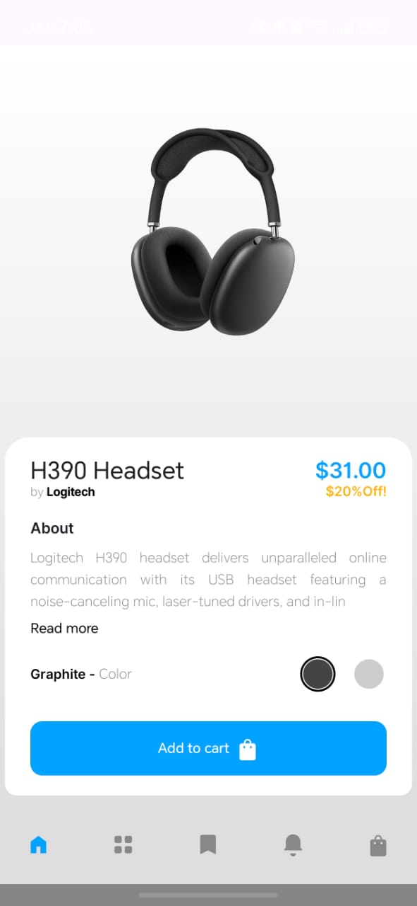
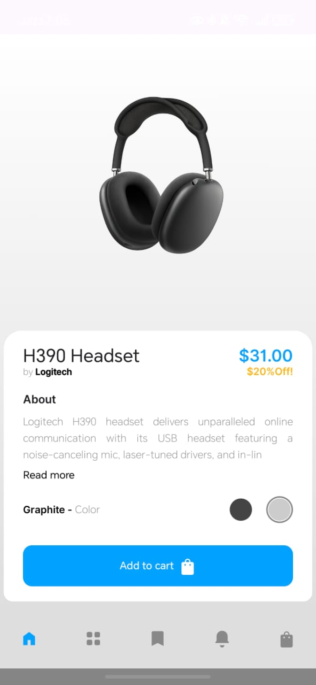
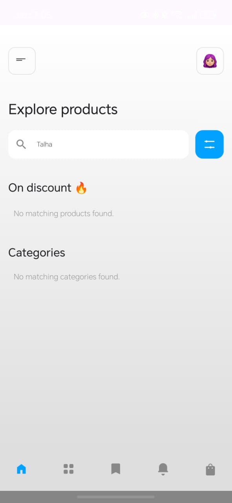

# 📱 TechStore-App (Created By : Talha Shafique)
Tech Store App

## 🛒 Description Tech Store App
The **TechStore App** is a cutting-edge mobile e-commerce platform designed to offer a premium, modern shopping experience for technology and electronic gadgets. Developed entirely with Jetpack Compose, the project's core focus is on delivering a visually stunning and highly functional GUI that captures the sleek, high-tech nature of the products it features.
The application follows the robust **MVVM (Model–View–ViewModel) architectural pattern**. In this structure, the **Composable Screens (Views)** are designed to flawlessly display data state managed by the ViewModels. The project includes essential **Data Model Classes (e.g., Product, User, CartItem)** to formally define the application's data structure and incorporates a streamlined Compose Navigation system to ensure a smooth, intuitive user journey through all the screens.

## ⚙️ Technologies Used
- 💻 **Language:** Kotlin
- 🎨 **UI Framework:** Jetpack Compose (Material 3)
- 🧩 **Architecture:** MVVM (Model–View–ViewModel)
- 🧭 **Navigation:** Compose Navigation
- 🖼️ **Image Loading:** Coil
- 🧠 **State Management:** Compose State and Flow
- 📱 **App Layouts:** GUI & Navigation

## 📱 App Screenshots
| **1. Splash Screen** | **2. Login Screen** | **3. Home Screen** |
| :---: | :---: | :---: |
|  |  |  |
| **4. Product Description Screen** | **5. Product Description Color Change Screen** | **6. Sreach Working Screen** |
|  |  |  |
